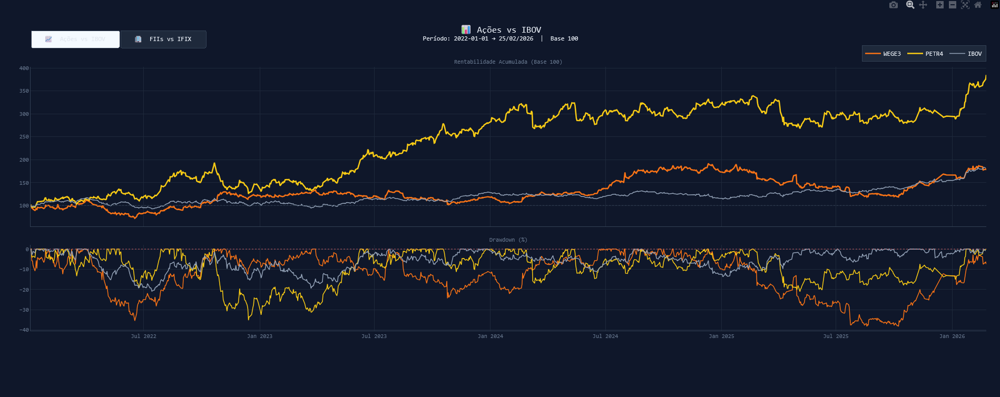
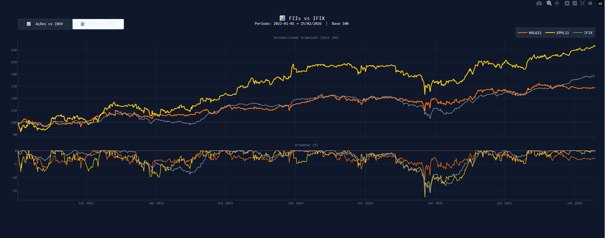

# 📊 Comparador B3 — Ações & FIIs vs Benchmarks

Gráfico interativo que compara a rentabilidade acumulada de ações e FIIs contra seus benchmarks (IBOV e IFIX), com análise de drawdown e métricas de risco, tudo calculado automaticamente.


---

## 📸 Preview

 <br />


---

## ✨ Funcionalidades

- **Dois modos interativos** — alterna entre Ações vs IBOV e FIIs vs IFIX com um clique, sem recarregar a página
- **Rentabilidade acumulada em Base 100** — comparação justa em base 100
- **Drawdown** — mostra a queda percentual de cada ativo em relação ao seu pico histórico
- **Benchmark em destaque** — IBOV e IFIX aparecem em cinza sólido, separados visualmente dos ativos
- **Exporta `.html` interativo** — pode ser aberto em qualquer navegador sem instalar nada

---

## ⚙️ Configuração

No topo do arquivo `comparador_b3.py` você encontra as únicas três coisas que precisa editar:

```python
API_KEY     = "API_VAROS"   # chave da API da Varos
DATA_INICIO = "2022-01-01"       # mude para o período que quiser analisar

ACOES = ["PETR4", "WEGE3"]       # coloque as ações que quiser comparar
FIIS  = ["HGLG11", "XPML11"]    # coloque os FIIs que quiser comparar
```

---

## 📈 Metodologia

| Conceito | Descrição |
|---|---|
| **Base 100** | Todas as séries começam em 100 no primeiro dia do período, permitindo comparar ativos com preços absolutamente diferentes |
| **Retorno total** | `(preço_final / preço_inicial - 1) × 100` |
| **Volatilidade anual** | Desvio padrão dos retornos diários × √252 — mede o risco do ativo |
| **Drawdown** | Queda percentual em relação ao pico histórico anterior — mede a pior perda sofrida |

---

## 🛠 Tecnologias

- **Python** — linguagem principal
- **Pandas** — manipulação e cálculo das séries temporais
- **Plotly** — gráficos interativos com botões de alternância
- **API Varos** — dados históricos de cotações da B3, ajustados por proventos e splits
